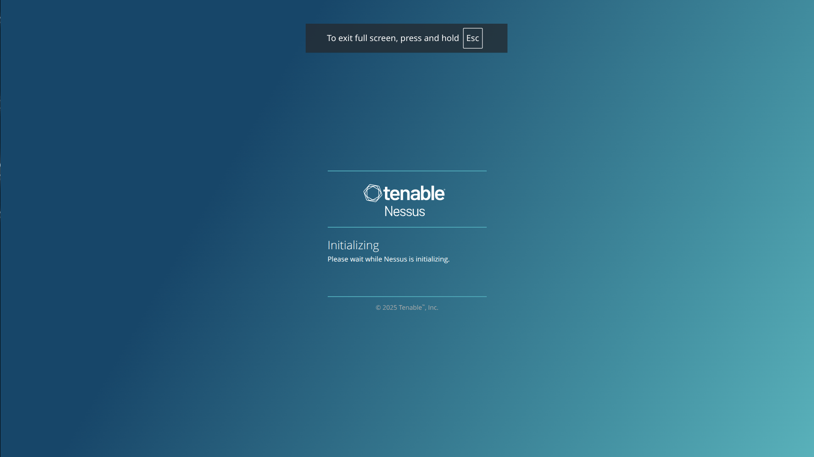
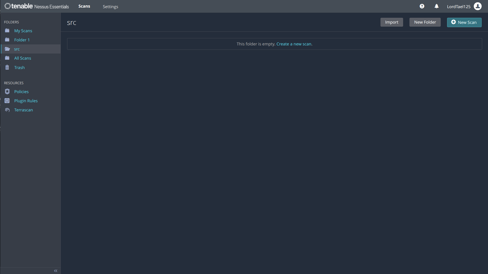
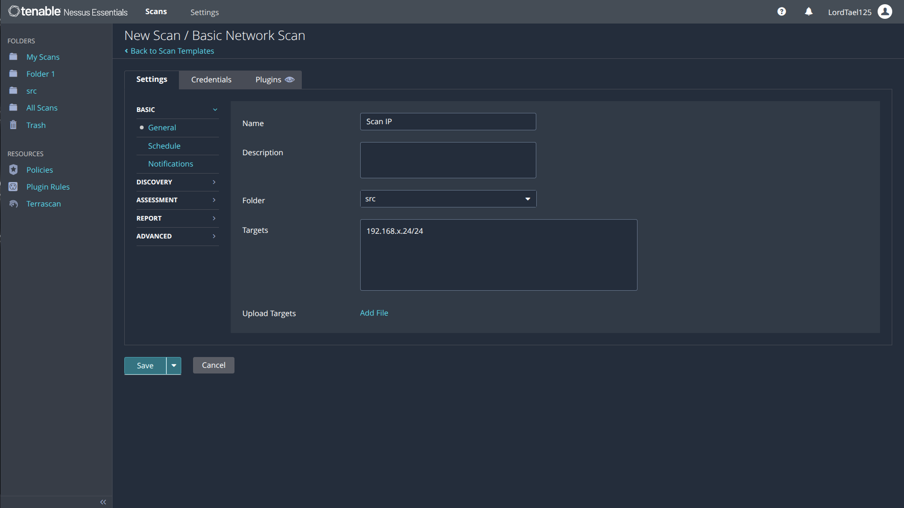
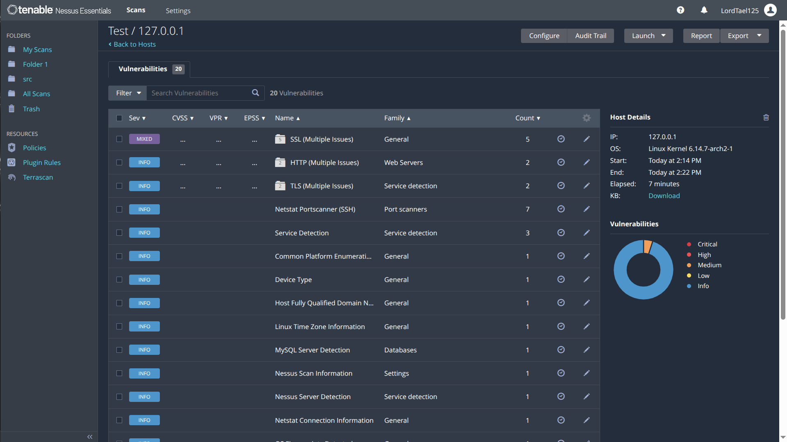
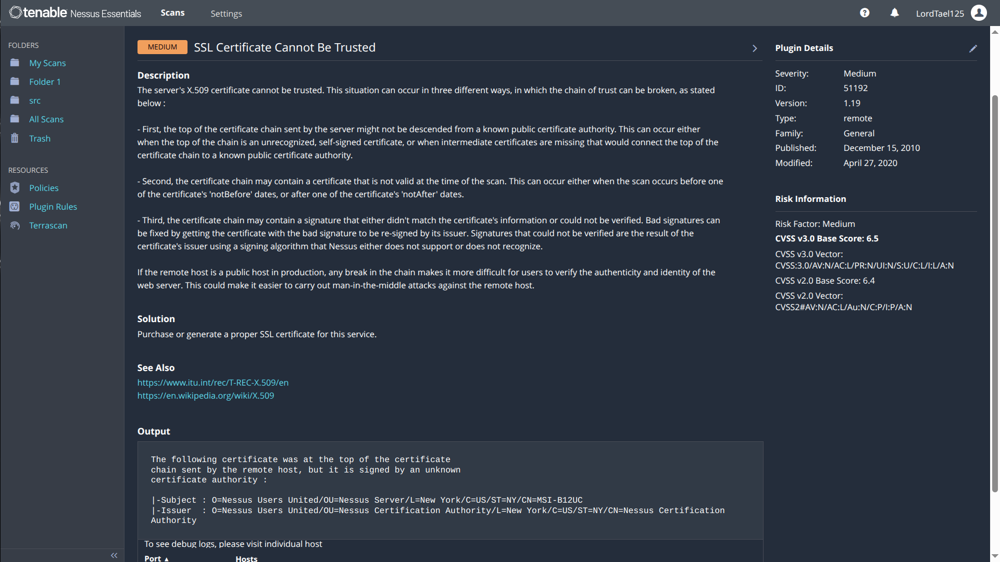

# ElateLabs-task3
Vulnerability scanning using Tenable neussus

This displays the working through Tenable neussus essentials to find vulnerabilities in network 

Installation of nessus for linux

1. For Archlinux : can be installed from aur

```
    yay -Sy neussus
```

2. For Debian based distro :

```
    dpkg -i Neussus-<ver>-debian6_amd64.deb
```

3. For fedora based distro

```
    dnf install neussus
```

Intiallization of neussus server

enabling neussus server : by default after installion of neussus needs to be enabled in systemd using command

```
    systemctl enable neussusd
    systemctl start neussusd
```

Then opening neussus will start intiallization procces then choose essential version



After initilization and plugin compilation login into neussus


The neussus server landing page will open then 


Create a new scan and give a name and enter localhost or ip address as target to scan



After performing scan neussus essential will present the vulnerabilities found on the localhost or IP adrress which can be exported out as neussus file or a report can be generated. After scanning the neussus will sort the vulnerability based on high to low


Then the vulnerabilities can be patched up for example a vulnerability detected is :


It can be patched up updating ca-certificates for the server

A report has attached at Data/Nessus/Localhost/Localhost_report.html & Data/Nessus/Main_IP/Network_Report to display how neussus generates a report based on scan

References :
    >>> neussus documentations